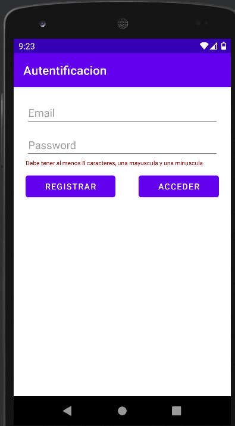
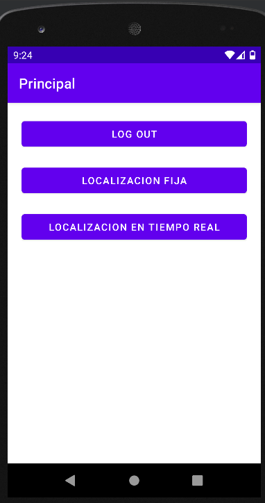
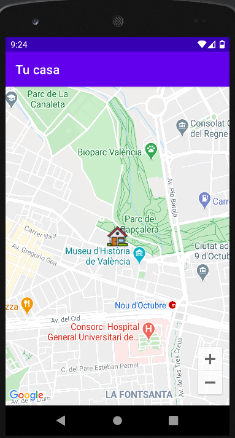
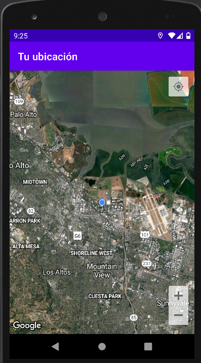

# Firebase Authenticator & Geolocalización

## Enlace Github

<https://github.com/jrodriguezballester/Practica-Login-Firebase-geolocalizacion.git>

### Usuario Registrado

email: ejemplo@ejemplo.com
contraseña: Ejemplo1

## 
 Práctica 6 - Firebase Authenticator & Geolocalización

En esta práctica, vamos a conocer las ventajas que nos proporciona Firebase. Para ello se
propone la visualización de los vídeos disponibles en el área de recursos del módulo de
PMDM para aprender a configurar una cuenta firebase y cómo crear proyectos y asociarlos
a vuestra aplicación en desarrollo.

Lo vídeos sobre Firebase, son los siguientes:

<https://www.youtube.com/watch?v=IiuKAmgRYeM>

<https://www.youtube.com/watch?v=dpURgJ4HkMk>

<https://www.youtube.com/watch?v=xjsgRe7FTCU>

<https://www.youtube.com/watch?v=t5yyc1XfQrs>

<https://www.youtube.com/watch?v=Xz9U4PcsLFI>

### Ejercicio 1: (50%)

- Configurar nuestra cuenta Firebase
- Crear una aplicación que integre el servicio de Firebase Authenticator.

  - Esta aplicación en primera instancia pedirá usuario y contraseña y nos permitirá hacer login o registrar un usuario si todavía no existe. Se tienen que implementar las validaciones.
  - Una vez realizado el login esta primera activity transicionará a una siguiente en la que podremos hacer logout.

Siguiendo con el desarrollo de la aplicación que hemos empezado se propone implementar
el servicio de localización. Para ello os propongo visualizar los vídeos disponibles en el área de recursos del módulo de PMDM para aprender a configurar en nuestra app dicho servicio
de localización e integrarlo en nuestra app.

Los vídeos sobre geoposicionamiento, son los siguientes:

<https://www.youtube.com/watch?v=DjbveamtmNs>

<https://www.youtube.com/watch?v=0qzwgJAuCeU>

<https://www.youtube.com/watch?v=Z90ObmEJ9bk>

<https://www.youtube.com/watch?v=b2D21Ke_tWE>

### Ejercicio 2: (50%)

En la segunda activity que estábamos implementando, dispondremos dos botones más a
parte del de logout.

Estos dos botones nos permitirán, en primer lugar mostrar una ubicación por defecto, la que
cada uno de vosotros elija. El segundo botón mostrará nuestra ubicación en tiempo real.

## 
Solucion (paso a paso)

### - Añadir Firebase

- Crear proyecto consola firebase <https://console.firebase.google.com/u/0/>

- Añadir Firebase a la aplicación. Clickamos en Android
  - Seguimos las instrucciones de Firebase
    - (añadir fichero google-services.josn)
    - (añadir SDK)
- Añadir en gradle de modulo en plugins  id 'kotlin-android-extensions'
- Importante sincronizar ambos gradle

### - Añadir Autentificacion por email/password

Desde la consola de Firebase seleccionar

- Autentificacion --> Sign Metodo --> Habilitar email/contraseña

<https://firebase.google.com/docs/auth/android/start?authuser=0#kotlin+ktx>

- en gradle (app)
  - implementation 'com.google.firebase:firebase-auth-ktx'
- Importante sincronizar gradle
- Crear AuthActivity
- Sincronizar gradle (Ya lo habia dicho?, pues por si acaso sincroniza gradle)

### - Implementar codigo AuthActivity

- Registrarse
  - Validar correo
  - Validar contraseña
  - Si se registra continua la app
  - Mostrar informacion en los casos negativos
- Logearse
  - Mismo codigo que registrarse, cambiando la funcion de Firebase createUserWith... por signInWith... y los mensajes informativos

### - Implementar MainActivity

Para la primera parte de la practica.

- Boton Log Out
  - Desconecta (singOut) de Firebase
  - Llamamos a la AuthActivity (mejor que onBackPressed())

### Localizacion Fija

- Crear layout: New layout-->Google-->Google Maps Activity

  Esto crea
  - Un Activity
  - Un layout
  - Values/google_maps_api.xml   <-- En este fichero hay que poner la clave
- Ir a google Api Console
  <https://console.developers.google.com/apis/dashboard?project=tidy-way-301717&folder=&organizationId=>
  - Crear un nuevo proyecto
  - Ir Credenciales-->Crear credenciales-->Clave de API-->Restringir Clave

  En la siguiente pantalla
  - Poner un nombre (no es obligatorio)
  - Apps de Android
  - Agregar un Elemento (Datos en Values/google_maps_api.xml)
    - nombre del paquete
    - firma SHA-1
  - Guardar
  - Ir a Panel y habilitar Apis
  - Ir a Credenciales y copiar clave de nuestra api
- Dentro de Values/google_maps_api.xml pegar la clave
- Llamar a la Activity
- Dentro de la Activity .kt escribir el codigo en particular
  - Modificar Latitud,longitud
  - Modificar zoom
  - Modificar icono

### Localizacion en tiempo real

- Se crea una FusedLocationProviderClient;
- Llamamos a su metodo getLastLocation () para obtener la posicion
- mostramos la posicion

## Imagenes

### Observaciones y mejoras al probar en dispositivo fisico

- Se ha modificado el SDK minimo, al API 22 del dispositivo movil
- Sin GPS no localiza anuque tenga internet
- No pregunta por la utilizacion de GPS/datos
- Mejoras de presentacion (icono,toolbar,diseño,...)
